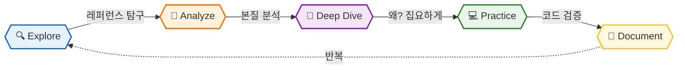

# 🔍 IQ Dev Lab

**AI와 함께 기술의 본질을 탐구하는 개발자의 딥다이브 연구소**

 

 

> *"Explore → Analyze → Practice → Document → Repeat"*

공식 문서와 표준 레퍼런스를 AI와 함께 **깊이 있게 분석**하고,  
**왜 이렇게 설계됐는가** 라는 질문으로 기술의 본질을 파헤칩니다.

---

## 📚 Projects & Studies

 

&nbsp;☕ &nbsp;<b>Java Core</b> &nbsp;&nbsp;

 

| &nbsp; | 📌 Title | 📝 Key Topics |
|:--:|:---------|:----------|
| 1 | [**오브젝트 (Objects)**](https://github.com/iq-dev-lab/object) | 코드로 이해하는 객체지향 설계, 역할/책임/협력 |
| 2 | [**Modern Java in Action**](https://github.com/iq-dev-lab/modern-java-in-action) | 자바 8+ 함수형 프로그래밍, 스트림 API, 람다 |
| 3 | [**Java API Reference**](https://github.com/iq-dev-lab/java-api-reference) | **자바 표준 라이브러리 원리**, 실무 패턴, 성능 최적화, 실행 가능한 예제 |
| 4 | [**Java Design Patterns**](https://github.com/iq-dev-lab/java-design-patterns) | **47가지 디자인 패턴**, GoF/아키텍처/동시성 패턴, 실전 Before/After 비교 |
| 5 | [**Unit Testing**](https://github.com/iq-dev-lab/unit-testing) | **단위 테스트 설계 원칙**, Mocking 전략(Stub/Spy/Fake), 안티패턴 분석 |
| 6 | [**Java Concurrency Deep Dive**](https://github.com/iq-dev-lab/java-concurrency-deep-dive) | **JVM 락 메커니즘 완전 분해**, Mark Word·Biased/Thin/Fat Lock, CAS·AQS 내부 구조, 가상 스레드 `40docs` |
| 7 | [**JVM Deep Dive**](https://github.com/iq-dev-lab/jvm-deep-dive) | **JVM 내부 구조 완전 해부**, 클래스 로딩/GC/JIT/메모리 모델, CPU 레벨 분석, 성능 튜닝 |

 

---

&nbsp;🍃 &nbsp;<b>Spring Ecosystem</b> &nbsp;&nbsp;

 

| &nbsp; | 📌 Title | 📝 Key Topics |
|:--:|:---------|:----------|
| 1 | [**Spring Core Deep Dive**](https://github.com/iq-dev-lab/spring-core-deep-dive) | **IoC 컨테이너 완전 해부**, DI 내부 동작, Bean 생명주기, AOP/Proxy 구현 원리, SpEL `51docs` |
| 2 | [**Spring Data & Transaction**](https://github.com/iq-dev-lab/spring-data-transaction) | **Spring Data JPA 내부 구조**, 트랜잭션 관리, Hibernate 통합, 쿼리 성능 튜닝, Connection Pool `45docs` |
| 3 | [**Spring Boot Internals**](https://github.com/iq-dev-lab/spring-boot-internals) | **Auto-configuration 내부 동작**, 스타트업 프로세스, Property 관리, Actuator, 내장 서버 구성 `45docs` |
| 4 | [**Spring MVC Deep Dive**](https://github.com/iq-dev-lab/spring-mvc-deep-dive) | **DispatcherServlet 완전 분해**, HandlerMapping/Adapter, ArgumentResolver, ExceptionHandler `45docs` |
| 5 | [**Spring Security Deep Dive**](https://github.com/iq-dev-lab/spring-security-deep-dive) | **FilterChainProxy 완전 분해**, AuthenticationManager 체인, JWT/SecurityContext, OAuth2 `45docs` |
| 6 | [**Spring Batch Deep Dive**](https://github.com/iq-dev-lab/spring-batch-deep-dive) | **ChunkOrientedTasklet 완전 분해**, ItemReader/Processor/Writer 체인, Partitioning 병렬 처리 `35docs` |
| 7 | [**Spring Cloud Deep Dive**](https://github.com/iq-dev-lab/spring-cloud-deep-dive) | **분산 시스템 내부 완전 해부**, Eureka Heartbeat, Gateway 필터 체인, Circuit Breaker 상태 전이 `40docs` |
| 8 | [**Spring WebFlux Deep Dive**](https://github.com/iq-dev-lab/spring-webflux-deep-dive) | **Reactive Streams 스펙 완전 분해**, Project Reactor Lazy Evaluation, Netty 아키텍처·epoll, R2DBC `40docs` |

 

---

&nbsp;🗄️ &nbsp;<b>Database</b> &nbsp;&nbsp;

 

| &nbsp; | 📌 Title | 📝 Key Topics |
|:--:|:---------|:----------|
| 1 | [**Database Internals Deep Dive**](https://github.com/iq-dev-lab/database-internals) | **InnoDB Buffer Pool/B-Tree 내부 구조**, MVCC·Undo Log, Gap Lock·Phantom Read, 격리 수준 완전 분해 `40docs` |
| 2 | [**MySQL Deep Dive**](https://github.com/iq-dev-lab/mysql-deep-dive) | **실행계획 분석·튜닝**, 서브쿼리→세미조인 변환, 파티션 프루닝, Binary Log 포맷, Replication Lag `38docs` |
| 3 | [**PostgreSQL Deep Dive**](https://github.com/iq-dev-lab/postgresql-deep-dive) | **MVCC·Dead Tuple·VACUUM 완전 분해**, Serializable Snapshot Isolation, B-Tree Index-Only Scan `41docs` |
| 4 | [**Redis Deep Dive**](https://github.com/iq-dev-lab/redis-deep-dive) | **Redis 내부 자료구조 완전 분해**, 지속성(RDB/AOF), 클러스터·센티넬, Pub/Sub vs Stream `37docs` |
| 5 | [**Elasticsearch Deep Dive**](https://github.com/iq-dev-lab/elasticsearch-deep-dive) | **Lucene 역색인 완전 분해**, BM25 점수 계산, Shard·Replica 분산 구조, Aggregation 내부 동작 `38docs` |
| 6 | [**DB Migration Deep Dive**](https://github.com/iq-dev-lab/db-migration-deep-dive) | **Flyway 체크섬 감지·적용 원리**, InnoDB Online DDL Lock 조건, Expand-Contract 무중단 컬럼 변경, Forward-Only 전략 `38docs` |

 

---

&nbsp;📨 &nbsp;<b>Messaging & Streaming</b> &nbsp;&nbsp;

 

| &nbsp; | 📌 Title | 📝 Key Topics |
|:--:|:---------|:----------|
| 1 | [**Kafka Deep Dive**](https://github.com/iq-dev-lab/kafka-deep-dive) | **파티션·ISR·리밸런싱 완전 분해**, acks/min.insync.replicas 트레이드오프, Exactly-Once 구현 원리 `37docs` |
| 2 | [**RabbitMQ Deep Dive**](https://github.com/iq-dev-lab/rabbitmq-deep-dive) | **Exchange 라우팅 완전 분해**, Quorum Queue 클러스터링, Outbox + Publisher Confirm 완전 보장 패턴 `38docs` |

 

---

&nbsp;🏛️ &nbsp;<b>Architecture & Design</b> &nbsp;&nbsp;

 

| &nbsp; | 📌 Title | 📝 Key Topics |
|:--:|:---------|:----------|
| 1 | [**Architecture Patterns Deep Dive**](https://github.com/iq-dev-lab/architecture-patterns-deep-dive) | **Layered → Hexagonal → Clean Architecture 완전 분해**, DIP 기반 개선, Uncle Bob 4원칙 `39docs` |
| 2 | [**DDD Deep Dive**](https://github.com/iq-dev-lab/ddd-deep-dive) | **Bounded Context 전략 설계**, Aggregate·Value Object·Domain Event 완전 분해, 도메인 테스트 전략 `43docs` |
| 3 | [**CQRS + Event Sourcing Deep Dive**](https://github.com/iq-dev-lab/cqrs-event-sourcing-deep-dive) | **CQS 원칙·비동기 Command 완전 분해**, Event Store·Projection 원리, 이벤트 소싱 통합 흐름 `40docs` |
| 4 | [**MSA Deep Dive**](https://github.com/iq-dev-lab/msa-deep-dive) | **모놀리스→MSA 전환 원칙**, Saga 분산 트랜잭션·보상 패턴, 서비스 경계 설계, Circuit Breaker `41docs` |
| 5 | [**System Design Deep Dive**](https://github.com/iq-dev-lab/system-design-deep-dive) | **대규모 시스템 설계 원칙**, URL 단축기·YouTube·검색 자동완성·라이브 스트리밍 케이스 스터디 `42docs` |

 

---

&nbsp;🔌 &nbsp;<b>API & Communication</b> &nbsp;&nbsp;

 

| &nbsp; | 📌 Title | 📝 Key Topics |
|:--:|:---------|:----------|
| 1 | [**gRPC + Protocol Buffers Deep Dive**](https://github.com/iq-dev-lab/grpc-deep-dive) | **Protobuf TLV 인코딩·필드 번호 계약 완전 분해**, HTTP/2 스트림 멀티플렉싱, Interceptor 체인, Deadline 전파, Buf Breaking Change 감지 `38docs` |

 

---

&nbsp;🔐 &nbsp;<b>Security Engineering</b> &nbsp;&nbsp;

 

| &nbsp; | 📌 Title | 📝 Key Topics |
|:--:|:---------|:----------|
| 1 | [**Security Engineering Deep Dive**](https://github.com/iq-dev-lab/security-engineering-deep-dive) | **공격자 관점 STRIDE 위협 모델링**, SQL Injection·XSS·CSRF 근본 원인 분해, JWT alg:none·알고리즘 혼동 공격, SSRF → AWS 자격증명 탈취 시나리오, OWASP Top 10 방어 설계 `41docs` |

 

---

&nbsp;⚡ &nbsp;<b>Performance & Quality</b> &nbsp;&nbsp;

 

| &nbsp; | 📌 Title | 📝 Key Topics |
|:--:|:---------|:----------|
| 1 | [**Performance Testing Deep Dive**](https://github.com/iq-dev-lab/performance-testing-deep-dive) | **k6 부하 테스트·p95/p99 정량 측정**, USE 방법론 병목 특정, async-profiler Flame Graph 코드 레벨 분석, Connection Pool 공식, GC Stop-The-World 측정 `39docs` |

 

---

&nbsp;🖥️ &nbsp;<b>Infrastructure & DevOps</b> &nbsp;&nbsp;

 

| &nbsp; | 📌 Title | 📝 Key Topics |
|:--:|:---------|:----------|
| 1 | [**Linux for Backend Deep Dive**](https://github.com/iq-dev-lab/linux-for-backend-deep-dive) | **커널 I/O·메모리 관리 완전 분해**, 프로세스·스레드·스케줄러, 시스템콜·epoll·시그널 `38docs` |
| 2 | [**Network Deep Dive**](https://github.com/iq-dev-lab/network-deep-dive) | **TCP 3-Way Handshake·TIME_WAIT**, TLS 1.3 핸드쉐이크, HTTP/2 멀티플렉싱·HOL Blocking `37docs` |
| 3 | [**Git In-Depth**](https://github.com/iq-dev-lab/git-in-depth) | **Git 내부 구조(Object Model)**, 복잡한 충돌 해결, Rebase 심화, 실전 트러블슈팅 |
| 4 | [**Docker Deep Dive**](https://github.com/iq-dev-lab/docker-deep-dive) | **Namespaces/Cgroups/UnionFS**, 이미지 최적화, 네트워킹/보안 원리, 실전 트러블슈팅 |
| 5 | [**Kubernetes Deep Dive**](https://github.com/iq-dev-lab/kubernetes-deep-dive) | **Control Plane 완전 분해**, etcd·API Server·Scheduler·kubelet 내부 동작, Pod 스케줄링·HPA `40docs` |
| 6 | [**Observability Deep Dive**](https://github.com/iq-dev-lab/observability-deep-dive) | **Java Agent 바이트코드 조작 원리**, Prometheus 수집 메커니즘, OpenTelemetry 분산 추적 `35docs` |
| 7 | [**CI/CD Pipeline Deep Dive**](https://github.com/iq-dev-lab/cicd-deep-dive) | **GitHub Actions Runner 격리·Job 스케줄링 완전 분해**, Docker 레이어 캐시 원리, ArgoCD Reconciliation Loop, 카나리 배포·Argo Rollouts AnalysisTemplate `40docs` |

 

 
💡 지속적으로 새로운 탐구 프로젝트가 추가될 예정입니다.

 

## 🛠️ Study Method

| Step | Description |
|------|-------------|
| 🔍 **Explore** | 공식 문서·표준 레퍼런스에서 탐구할 개념 선정 |
| 🤖 **Analyze** | AI(Claude)와 대화하며 개념의 본질 분석 |
| 💭 **Deep Dive** | "왜?"라는 질문을 통해 설계 원리 심층 탐구 |
| 💻 **Practice** | 실제 코드·실험으로 검증 및 변형 실습 |
| 📝 **Document** | 나만의 언어로 재해석하여 체계적으로 정리 |

 

## 💡 Philosophy

> **"단순한 요약은 AI도 할 수 있습니다.**  
> **우리는 AI와 대화하며 얻은 통찰(Insight)을 기록합니다."**

### Why AI-Assisted Deep Dive?

- 🎯 **즉각적 피드백** - 궁금한 점을 바로 질문하고 본질에 다가갑니다
- 🔍 **다각도 분석** - 하나의 개념을 여러 관점에서 해부합니다
- 💬 **대화형 탐구** - 단순 암기가 아닌 "왜?"를 중심으로 한 학습
- 📊 **설계 원리 추적** - 표면적 사용법이 아닌 내부 동작과 설계 의도 파악

 

## 🔗 About

*AI와의 문답으로 기술의 본질을 탐구하는 개발자의 딥다이브 기록*

 

**⭐️ 도움이 되셨다면 Star를 눌러주세요!**

