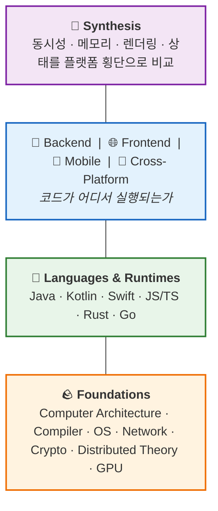
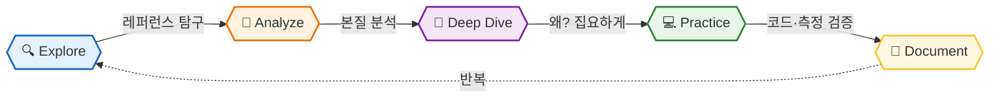

<h1 align="center">
  
  IQ Dev Lab
</h1>

**개발의 본질을 파고드는 풀스택 딥다이브 연구소**

 

 

> *"Beyond the docs — into the essence of software engineering."*

공식 문서와 표준 레퍼런스를 **깊이 있게 분석**하고,  
**왜 이렇게 설계됐는가** 라는 질문으로 기술의 본질을 파헤칩니다.

하드웨어부터 언어·런타임, 백엔드·프론트·모바일, 그리고 이 모두를 가로지르는 설계 원리까지 —  
**한 가지 일관된 렌즈**(실행·메모리·동시성·렌더링·일관성)로 개발 전반을 관통합니다.

 

---

## 🗺️ Architecture — 4-Layer Stack

이 연구소는 분야를 나열하지 않고 **스택 레이어**로 쌓습니다. 위 레이어는 아래 레이어 위에서 동작하고,  
같은 본질 질문(동시성·메모리·렌더링·일관성)이 레이어를 가로질러 반복됩니다.

```mermaid
graph TD
    SYN["🧬 <b>Synthesis</b><br/>동시성 · 메모리 · 렌더링 · 상태를 플랫폼 횡단으로 비교"]
    PLAT["🔧 Backend &nbsp;|&nbsp; 🌐 Frontend &nbsp;|&nbsp; 📱 Mobile &nbsp;|&nbsp; 🔀 Cross-Platform<br/><i>코드가 어디서 실행되는가</i>"]
    LANG["🧱 <b>Languages &amp; Runtimes</b><br/>Java · Kotlin · Swift · JS/TS · Rust · Go"]
    FND["🪨 <b>Foundations</b><br/>Computer Architecture · Compiler · OS · Network · Crypto · Distributed Theory · GPU"]

    SYN --- PLAT
    PLAT --- LANG
    LANG --- FND

    style SYN fill:#f3e5f5,stroke:#7b1fa2,stroke-width:2px
    style PLAT fill:#e3f2fd,stroke:#1565c0,stroke-width:2px
    style LANG fill:#e8f5e9,stroke:#2e7d32,stroke-width:2px
    style FND fill:#fff3e0,stroke:#ef6c00,stroke-width:2px
```

> **완성의 기준** — "분야를 다 모았나"가 아니라 **"레이어가 다 찼나"**. 새 언어·DB·툴이 나와도 새 분야가 아니라 *기존 레이어의 한 칸*으로 들어갑니다.

🟢 운영 중 &nbsp;·&nbsp; 🆕 확장 예정(로드맵)

---

## 📚 Projects & Studies

### 🪨 Foundations &nbsp;모든 것의 바닥

&nbsp;🪨 &nbsp;<b>Foundations</b> &nbsp;&nbsp;&nbsp;

 

| &nbsp; | 📌 Title | 📝 Key Topics |
|:--:|:---------|:----------|
| 1 | [**Computer Architecture Deep Dive**](https://github.com/iq-dev-lab/computer-architecture-deep-dive) | 🆕 **CPU 파이프라인·캐시 계층·False Sharing**, 분기 예측, 메모리 모델·배리어, SIMD, NUMA — "왜 느린가"의 최종 수렴점 `38docs` |
| 2 | [**Compiler & Language Implementation**](https://github.com/iq-dev-lab/compiler-deep-dive) | 🆕 **Lexer/Parser/AST → 타입 체커 → IR → 코드 생성**, JIT vs AOT, SSA — JVM·V8·ART·TS의 공통 골격 `40docs` |
| 3 | [**Cryptography Deep Dive**](https://github.com/iq-dev-lab/cryptography-deep-dive) | 🆕 **대칭/비대칭·해시·키교환(ECDH)·서명·KDF**, TLS 핸드쉐이크 수학 — Auth·JWT·TLS의 바닥 `36docs` |
| 4 | [**Distributed Systems Theory**](https://github.com/iq-dev-lab/distributed-systems-theory-deep-dive) | 🆕 **Consensus(Raft/Paxos)·CAP/PACELC·Vector Clock·CRDT·Gossip** — Kafka·K8s·Saga의 이론적 뿌리 `42docs` |
| 5 | [**GPU & Graphics Pipeline**](https://github.com/iq-dev-lab/gpu-graphics-deep-dive) | 🆕 **정점→래스터화→프래그먼트 셰이더**, WebGPU/Metal/Vulkan, GLSL/WGSL — Browser·Compose·SwiftUI 렌더링의 공통 바닥 `38docs` |

 

---

### 🧱 Languages & Runtimes &nbsp;티어에 안 묶이는 언어

&nbsp;🧱 &nbsp;<b>Languages & Runtimes</b> &nbsp;&nbsp;&nbsp;

 

| &nbsp; | 📌 Title | 📝 Key Topics |
|:--:|:---------|:----------|
| 1 | [**Rust Deep Dive**](https://github.com/iq-dev-lab/rust-deep-dive) | 🆕 **소유권·빌림 검사기·라이프타임**, `Send`/`Sync`, 런타임 없는 async, zero-cost 추상화, GC 없는 메모리 안전 `42docs` |
| 2 | [**Go Deep Dive**](https://github.com/iq-dev-lab/go-deep-dive) | 🆕 **M:N 고루틴 스케줄러(GMP)**, 채널·`select`, 삼색 표시 GC, 메모리 모델, 인터페이스 동적 디스패치 `38docs` |

 

※ Java/Kotlin/Swift/JS·TS는 각 플랫폼 맥락(Backend·Mobile·Frontend)에서 다룹니다.

---

### 🔧 Backend Engineering &nbsp;서버 사이드의 본질

&nbsp;☕ &nbsp;<b>Java Core</b> &nbsp;&nbsp;

 

| &nbsp; | 📌 Title | 📝 Key Topics |
|:--:|:---------|:----------|
| 1 | [**오브젝트 (Objects)**](https://github.com/iq-dev-lab/object) | 코드로 이해하는 객체지향 설계, 역할/책임/협력 |
| 2 | [**Modern Java in Action**](https://github.com/iq-dev-lab/modern-java-in-action) | 자바 8+ 함수형 프로그래밍, 스트림 API, 람다 |
| 3 | [**Java API Reference**](https://github.com/iq-dev-lab/java-api-reference) | **자바 표준 라이브러리 원리**, 실무 패턴, 성능 최적화, 실행 가능한 예제 |
| 4 | [**Java Design Patterns**](https://github.com/iq-dev-lab/java-design-patterns) | **47가지 디자인 패턴**, GoF/아키텍처/동시성 패턴, 실전 Before/After 비교 |
| 5 | [**Unit Testing**](https://github.com/iq-dev-lab/unit-testing) | **단위 테스트 설계 원칙**, Mocking 전략(Stub/Spy/Fake), 안티패턴 분석 |
| 6 | [**Java Concurrency Deep Dive**](https://github.com/iq-dev-lab/java-concurrency-deep-dive) | **JVM 락 메커니즘 완전 분해**, Mark Word·Biased/Thin/Fat Lock, CAS·AQS 내부 구조, 가상 스레드 `40docs` |
| 7 | [**JVM Deep Dive**](https://github.com/iq-dev-lab/jvm-deep-dive) | **JVM 내부 구조 완전 해부**, 클래스 로딩/GC/JIT/메모리 모델, CPU 레벨 분석, 성능 튜닝 |

 

&nbsp;🍃 &nbsp;<b>Spring Ecosystem</b> &nbsp;&nbsp;

 

| &nbsp; | 📌 Title | 📝 Key Topics |
|:--:|:---------|:----------|
| 1 | [**Spring Core Deep Dive**](https://github.com/iq-dev-lab/spring-core-deep-dive) | **IoC 컨테이너 완전 해부**, DI 내부 동작, Bean 생명주기, AOP/Proxy 구현 원리, SpEL `51docs` |
| 2 | [**Spring Data & Transaction**](https://github.com/iq-dev-lab/spring-data-transaction) | **Spring Data JPA 내부 구조**, 트랜잭션 관리, Hibernate 통합, 쿼리 성능 튜닝, Connection Pool `45docs` |
| 3 | [**Spring Boot Internals**](https://github.com/iq-dev-lab/spring-boot-internals) | **Auto-configuration 내부 동작**, 스타트업 프로세스, Property 관리, Actuator, 내장 서버 구성 `45docs` |
| 4 | [**Spring MVC Deep Dive**](https://github.com/iq-dev-lab/spring-mvc-deep-dive) | **DispatcherServlet 완전 분해**, HandlerMapping/Adapter, ArgumentResolver, ExceptionHandler `45docs` |
| 5 | [**Spring Security Deep Dive**](https://github.com/iq-dev-lab/spring-security-deep-dive) | **FilterChainProxy 완전 분해**, AuthenticationManager 체인, JWT/SecurityContext, OAuth2 `45docs` |
| 6 | [**Spring Batch Deep Dive**](https://github.com/iq-dev-lab/spring-batch-deep-dive) | **ChunkOrientedTasklet 완전 분해**, ItemReader/Processor/Writer 체인, Partitioning 병렬 처리 `35docs` |
| 7 | [**Spring Cloud Deep Dive**](https://github.com/iq-dev-lab/spring-cloud-deep-dive) | **분산 시스템 내부 완전 해부**, Eureka Heartbeat, Gateway 필터 체인, Circuit Breaker 상태 전이 `40docs` |
| 8 | [**Spring WebFlux Deep Dive**](https://github.com/iq-dev-lab/spring-webflux-deep-dive) | **Reactive Streams 스펙 완전 분해**, Project Reactor Lazy Evaluation, Netty 아키텍처·epoll, R2DBC `40docs` |

 

&nbsp;🏛️ &nbsp;<b>Architecture & Design</b> &nbsp;&nbsp;

 

| &nbsp; | 📌 Title | 📝 Key Topics |
|:--:|:---------|:----------|
| 1 | [**Architecture Patterns Deep Dive**](https://github.com/iq-dev-lab/architecture-patterns-deep-dive) | **Layered → Hexagonal → Clean Architecture 완전 분해**, DIP 기반 개선, Uncle Bob 4원칙 `39docs` |
| 2 | [**DDD Deep Dive**](https://github.com/iq-dev-lab/ddd-deep-dive) | **Bounded Context 전략 설계**, Aggregate·Value Object·Domain Event 완전 분해, 도메인 테스트 전략 `43docs` |
| 3 | [**CQRS + Event Sourcing Deep Dive**](https://github.com/iq-dev-lab/cqrs-event-sourcing-deep-dive) | **CQS 원칙·비동기 Command 완전 분해**, Event Store·Projection 원리, 이벤트 소싱 통합 흐름 `40docs` |
| 4 | [**MSA Deep Dive**](https://github.com/iq-dev-lab/msa-deep-dive) | **모놀리스→MSA 전환 원칙**, Saga 분산 트랜잭션·보상 패턴, 서비스 경계 설계, Circuit Breaker `41docs` |
| 5 | [**System Design Deep Dive**](https://github.com/iq-dev-lab/system-design-deep-dive) | **대규모 시스템 설계 원칙**, URL 단축기·YouTube·검색 자동완성·라이브 스트리밍 케이스 스터디 `42docs` |

 

&nbsp;🖥️ &nbsp;<b>Infrastructure & DevOps</b> &nbsp;&nbsp;

 

| &nbsp; | 📌 Title | 📝 Key Topics |
|:--:|:---------|:----------|
| 1 | [**Linux for Backend Deep Dive**](https://github.com/iq-dev-lab/linux-for-backend-deep-dive) | **커널 I/O·메모리 관리 완전 분해**, 프로세스·스레드·스케줄러, 시스템콜·epoll·시그널 `38docs` |
| 2 | [**Network Deep Dive**](https://github.com/iq-dev-lab/network-deep-dive) | **TCP 3-Way Handshake·TIME_WAIT**, TLS 1.3 핸드쉐이크, HTTP/2 멀티플렉싱·HOL Blocking `37docs` |
| 3 | [**Git In-Depth**](https://github.com/iq-dev-lab/git-in-depth) | **Git 내부 구조(Object Model)**, 복잡한 충돌 해결, Rebase 심화, 실전 트러블슈팅 |
| 4 | [**Docker Deep Dive**](https://github.com/iq-dev-lab/docker-deep-dive) | **Namespaces/Cgroups/UnionFS**, 이미지 최적화, 네트워킹/보안 원리, 실전 트러블슈팅 |
| 5 | [**Kubernetes Deep Dive**](https://github.com/iq-dev-lab/kubernetes-deep-dive) | **Control Plane 완전 분해**, etcd·API Server·Scheduler·kubelet 내부 동작, Pod 스케줄링·HPA `40docs` |
| 6 | [**Observability Deep Dive**](https://github.com/iq-dev-lab/observability-deep-dive) | **Java Agent 바이트코드 조작 원리**, Prometheus 수집 메커니즘, OpenTelemetry 분산 추적 `35docs` |
| 7 | [**CI/CD Pipeline Deep Dive**](https://github.com/iq-dev-lab/cicd-deep-dive) | **GitHub Actions Runner 격리·Job 스케줄링 완전 분해**, Docker 레이어 캐시 원리, ArgoCD Reconciliation Loop, 카나리 배포 `40docs` |
| 8 | [**IaC Deep Dive**](https://github.com/iq-dev-lab/iac-deep-dive) | 🆕 **Terraform 상태·plan/apply 그래프**, Provider 프로토콜, 드리프트 감지, 멱등성 보장 원리 `35docs` |
| 9 | [**Service Mesh Deep Dive**](https://github.com/iq-dev-lab/service-mesh-deep-dive) | 🆕 **Envoy 데이터플레인·Sidecar 주입**, mTLS, 트래픽 정책, Istio 컨트롤플레인 `34docs` |

 

&nbsp;🗄️ &nbsp;<b>Database</b> &nbsp;&nbsp;

 

| &nbsp; | 📌 Title | 📝 Key Topics |
|:--:|:---------|:----------|
| 1 | [**Database Internals Deep Dive**](https://github.com/iq-dev-lab/database-internals) | **InnoDB Buffer Pool/B-Tree 내부 구조**, MVCC·Undo Log, Gap Lock·Phantom Read, 격리 수준 완전 분해 `40docs` |
| 2 | [**MySQL Deep Dive**](https://github.com/iq-dev-lab/mysql-deep-dive) | **실행계획 분석·튜닝**, 서브쿼리→세미조인 변환, 파티션 프루닝, Binary Log 포맷, Replication Lag `38docs` |
| 3 | [**PostgreSQL Deep Dive**](https://github.com/iq-dev-lab/postgresql-deep-dive) | **MVCC·Dead Tuple·VACUUM 완전 분해**, Serializable Snapshot Isolation, B-Tree Index-Only Scan `41docs` |
| 4 | [**Redis Deep Dive**](https://github.com/iq-dev-lab/redis-deep-dive) | **Redis 내부 자료구조 완전 분해**, 지속성(RDB/AOF), 클러스터·센티넬, Pub/Sub vs Stream `37docs` |
| 5 | [**Elasticsearch Deep Dive**](https://github.com/iq-dev-lab/elasticsearch-deep-dive) | **Lucene 역색인 완전 분해**, BM25 점수 계산, Shard·Replica 분산 구조, Aggregation 내부 동작 `38docs` |
| 6 | [**DB Migration Deep Dive**](https://github.com/iq-dev-lab/db-migration-deep-dive) | **Flyway 체크섬 감지·적용 원리**, InnoDB Online DDL Lock 조건, Expand-Contract 무중단 변경, Forward-Only 전략 `38docs` |

 

&nbsp;📨 &nbsp;<b>Messaging & Streaming</b> &nbsp;&nbsp;

 

| &nbsp; | 📌 Title | 📝 Key Topics |
|:--:|:---------|:----------|
| 1 | [**Kafka Deep Dive**](https://github.com/iq-dev-lab/kafka-deep-dive) | **파티션·ISR·리밸런싱 완전 분해**, acks/min.insync.replicas 트레이드오프, Exactly-Once 구현 원리 `37docs` |
| 2 | [**RabbitMQ Deep Dive**](https://github.com/iq-dev-lab/rabbitmq-deep-dive) | **Exchange 라우팅 완전 분해**, Quorum Queue 클러스터링, Outbox + Publisher Confirm 완전 보장 패턴 `38docs` |

 

&nbsp;🔌 &nbsp;<b>API & Communication</b> &nbsp;&nbsp;

 

| &nbsp; | 📌 Title | 📝 Key Topics |
|:--:|:---------|:----------|
| 1 | [**gRPC + Protocol Buffers Deep Dive**](https://github.com/iq-dev-lab/grpc-deep-dive) | **Protobuf TLV 인코딩·필드 번호 계약 완전 분해**, HTTP/2 스트림 멀티플렉싱, Interceptor 체인, Deadline 전파, Buf Breaking Change 감지 `38docs` |

 

&nbsp;🔐 &nbsp;<b>Security Engineering</b> &nbsp;&nbsp;

 

| &nbsp; | 📌 Title | 📝 Key Topics |
|:--:|:---------|:----------|
| 1 | [**Security Engineering Deep Dive**](https://github.com/iq-dev-lab/security-engineering-deep-dive) | **공격자 관점 STRIDE 위협 모델링**, SQL Injection·XSS·CSRF 근본 원인 분해, JWT alg:none·알고리즘 혼동 공격, SSRF → AWS 자격증명 탈취 시나리오, OWASP Top 10 방어 설계 `41docs` |

 

&nbsp;⚡ &nbsp;<b>Performance & Quality</b> &nbsp;&nbsp;

 

| &nbsp; | 📌 Title | 📝 Key Topics |
|:--:|:---------|:----------|
| 1 | [**Performance Testing Deep Dive**](https://github.com/iq-dev-lab/performance-testing-deep-dive) | **k6 부하 테스트·p95/p99 정량 측정**, USE 방법론 병목 특정, async-profiler Flame Graph 코드 레벨 분석, Connection Pool 공식, GC Stop-The-World 측정 `39docs` |

 

&nbsp;📊 &nbsp;<b>Data Engineering</b> &nbsp;&nbsp;&nbsp;

 

| &nbsp; | 📌 Title | 📝 Key Topics |
|:--:|:---------|:----------|
| 1 | [**Spark Internals Deep Dive**](https://github.com/iq-dev-lab/spark-internals-deep-dive) | 🆕 **DAG 스케줄러·Stage·Shuffle**, Catalyst·Tungsten, RDD vs DataFrame, 메모리 관리 `38docs` |
| 2 | [**Stream Processing Deep Dive**](https://github.com/iq-dev-lab/stream-processing-deep-dive) | 🆕 **Flink 상태 관리·체크포인트**, Watermark·이벤트 타임, Exactly-Once, 윈도잉 `36docs` |
| 3 | [**Columnar & Storage Format**](https://github.com/iq-dev-lab/columnar-storage-format-deep-dive) | 🆕 **Parquet/ORC 인코딩**, 압축·Predicate Pushdown, Lakehouse(Iceberg/Delta) `34docs` |

 

---

### 🌐 Frontend / Web &nbsp;클라이언트의 본질

&nbsp;🌐 &nbsp;<b>Web Platform & Engine</b> &nbsp;&nbsp;&nbsp;

 

| &nbsp; | 📌 Title | 📝 Key Topics |
|:--:|:---------|:----------|
| 1 | [**Browser Rendering Deep Dive**](https://github.com/iq-dev-lab/browser-rendering-deep-dive) | 🆕 **Critical Rendering Path**, DOM/CSSOM→Render Tree, Layout·Paint·Composite 분리, Layer 승격, Blink 아키텍처 `38docs` |
| 2 | [**V8 Engine Deep Dive**](https://github.com/iq-dev-lab/v8-engine-deep-dive) | 🆕 **Ignition→Sparkplug→Maglev→TurboFan**, Hidden Class·Inline Cache, Orinoco GC, Deopt `40docs` |
| 3 | [**Event Loop & Async Deep Dive**](https://github.com/iq-dev-lab/event-loop-async-deep-dive) | 🆕 **Macro/Microtask 큐**, rAF·렌더링 타이밍, libuv 대조, Task Starvation, `await`의 실제 동작 `35docs` |
| 4 | [**Web APIs & WASM Deep Dive**](https://github.com/iq-dev-lab/web-apis-wasm-deep-dive) | 🆕 **DOM 내부 표현**, Service/Web Worker, WebAssembly 실행 모델, Streams API `36docs` |

 

&nbsp;⚛️ &nbsp;<b>Web Language & Framework</b> &nbsp;&nbsp;&nbsp;

 

| &nbsp; | 📌 Title | 📝 Key Topics |
|:--:|:---------|:----------|
| 1 | [**JavaScript Deep Dive**](https://github.com/iq-dev-lab/javascript-deep-dive) | 🆕 **실행 컨텍스트·스코프 체인**, 클로저 메모리 모델, 프로토타입 체인, `this` 바인딩, ESM vs CJS `38docs` |
| 2 | [**TypeScript Type System**](https://github.com/iq-dev-lab/typescript-type-system-deep-dive) | 🆕 **구조적 타이핑**, 제네릭·조건부·매핑 타입, 추론 알고리즘, 공변/반공변, Checker 내부 `37docs` |
| 3 | [**React Internals Deep Dive**](https://github.com/iq-dev-lab/react-internals-deep-dive) | 🆕 **Fiber 아키텍처·Work Loop**, Reconciliation, Lane 우선순위, Hooks 내부, Concurrent·RSC `45docs` |
| 4 | [**State Management Deep Dive**](https://github.com/iq-dev-lab/frontend-state-management-deep-dive) | 🆕 **Flux/Redux 단방향**, Signal 반응성, Proxy 기반(MobX/Valtio), 세밀 반응성 vs VDOM `35docs` |
| 5 | [**Rendering Strategy Deep Dive**](https://github.com/iq-dev-lab/rendering-strategy-deep-dive) | 🆕 **CSR/SSR/SSG/ISR/RSC**, Next.js 내부, Streaming SSR·Selective Hydration `38docs` |
| 6 | [**CSS Engine & Layout**](https://github.com/iq-dev-lab/css-engine-layout-deep-dive) | 🆕 **박스 모델·Flexbox/Grid 알고리즘**, Cascade·Specificity, BFC·Stacking Context `37docs` |
| 7 | [**Build Tools Deep Dive**](https://github.com/iq-dev-lab/frontend-build-tools-deep-dive) | 🆕 **모듈 해석**, Webpack/Vite/esbuild/Rollup, Tree Shaking, HMR 원리 `36docs` |
| 8 | [**Web Performance Deep Dive**](https://github.com/iq-dev-lab/web-performance-deep-dive) | 🆕 **Core Web Vitals(LCP/INP/CLS)**, CRP 최적화, Code Splitting, 메모리 누수 `38docs` |
| 9 | [**Real-time & Client Networking**](https://github.com/iq-dev-lab/realtime-client-networking-deep-dive) | 🆕 **WebSocket·WebRTC·SSE 내부**, 연결 관리, 백프레셔, 클라이언트 동기화 `35docs` |

 

---

### 📱 Mobile &nbsp;온디바이스의 본질

&nbsp;🤖 &nbsp;<b>Android</b> &nbsp;&nbsp;&nbsp;

 

| &nbsp; | 📌 Title | 📝 Key Topics |
|:--:|:---------|:----------|
| 1 | [**Android Runtime (ART)**](https://github.com/iq-dev-lab/android-runtime-deep-dive) | 🆕 **Dalvik→ART**, AOT/JIT 하이브리드, Baseline Profile, DEX·OAT, Concurrent Copying GC `38docs` |
| 2 | [**Framework Internals**](https://github.com/iq-dev-lab/android-framework-internals-deep-dive) | 🆕 **Binder IPC 완전 분해**, Looper/Handler/MessageQueue, 생명주기 실제 흐름, Zygote `40docs` |
| 3 | [**Kotlin Deep Dive**](https://github.com/iq-dev-lab/kotlin-deep-dive) | 🆕 **코루틴 내부(CPS·상태머신)**, 구조적 동시성, Flow·백프레셔, inline 바이트코드 `42docs` |
| 4 | [**Jetpack Compose Internals**](https://github.com/iq-dev-lab/jetpack-compose-internals-deep-dive) | 🆕 **Recomposition·Slot Table(Gap Buffer)**, Positional Memoization, Snapshot State(MVCC 유사) `42docs` |
| 5 | [**Android Architecture**](https://github.com/iq-dev-lab/android-architecture-deep-dive) | 🆕 **MVVM·MVI 단방향 흐름**, Clean Architecture, 멀티 모듈화, Hilt 컴파일타임 그래프 `39docs` |
| 6 | [**Android Performance**](https://github.com/iq-dev-lab/android-performance-deep-dive) | 🆕 **Choreographer·Jank 측정**, ANR 근본원인, Baseline Profile, Macrobenchmark `36docs` |
| 7 | [**Local-first & Sync (CRDT)**](https://github.com/iq-dev-lab/local-first-sync-deep-dive) | 🆕 **SQLite/Room 내부**, 오프라인 동기화, 충돌 해결, CRDT — Distributed Theory와 연결 `35docs` |

 

&nbsp;🍎 &nbsp;<b>iOS</b> &nbsp;&nbsp;&nbsp;

 

| &nbsp; | 📌 Title | 📝 Key Topics |
|:--:|:---------|:----------|
| 1 | [**Swift Deep Dive**](https://github.com/iq-dev-lab/swift-deep-dive) | 🆕 **ARC·메모리 레이아웃**, 값/참조·COW, 프로토콜 Witness Table, Existential, 제네릭 특수화 `42docs` |
| 2 | [**Objective-C Runtime**](https://github.com/iq-dev-lab/objc-runtime-deep-dive) | 🆕 **`objc_msgSend`·isa·메타클래스**, 메서드 캐시, Swizzling, KVO 원리 `35docs` |
| 3 | [**iOS Lifecycle & RunLoop**](https://github.com/iq-dev-lab/ios-lifecycle-runloop-deep-dive) | 🆕 **RunLoop 모드**, 앱·씬 생명주기, 메인스레드 렌더 타이밍, Autorelease Pool `34docs` |
| 4 | [**SwiftUI Internals**](https://github.com/iq-dev-lab/swiftui-internals-deep-dive) | 🆕 **선언적 렌더링·View Identity**, `@State`/`@Binding`, AttributeGraph 의존성 엔진, Diffing `40docs` |
| 5 | [**UIKit & Core Animation**](https://github.com/iq-dev-lab/uikit-core-animation-deep-dive) | 🆕 **렌더 파이프라인·Layer Tree**, Render Server(별도 프로세스), Offscreen Rendering `38docs` |
| 6 | [**Swift Concurrency**](https://github.com/iq-dev-lab/swift-concurrency-deep-dive) | 🆕 **GCD 내부**, async/await 상태머신, Actor·Sendable 격리, 구조적 동시성 `40docs` |

 

---

### 🔀 Cross-Platform &nbsp;한 코드, 여러 플랫폼

&nbsp;🔀 &nbsp;<b>Cross-Platform</b> &nbsp;&nbsp;&nbsp;

 

| &nbsp; | 📌 Title | 📝 Key Topics |
|:--:|:---------|:----------|
| 1 | [**React Native Deep Dive**](https://github.com/iq-dev-lab/react-native-deep-dive) | 🆕 **Legacy Bridge → New Architecture**, JSI, Fabric(C++ Shadow Tree), TurboModules, Hermes `38docs` |
| 2 | [**Flutter Deep Dive**](https://github.com/iq-dev-lab/flutter-deep-dive) | 🆕 **Dart VM(AOT/JIT·Isolate)**, 3-Tree, Skia→Impeller, Build/Layout/Paint/Composite `38docs` |
| 3 | [**Kotlin Multiplatform (KMP)**](https://github.com/iq-dev-lab/kotlin-multiplatform-deep-dive) | 🆕 **expect/actual**, 공유 로직 컴파일, Native 메모리 모델, 플랫폼 인터롭 `34docs` |

 

---

### 🧬 Synthesis &nbsp;플랫폼을 가로지르는 본질 — 이 연구소의 무기

&nbsp;🧬 &nbsp;<b>Synthesis</b> &nbsp;&nbsp;&nbsp;

 

| &nbsp; | 📌 Title | 📝 묶는 대상 |
|:--:|:---------|:----------|
| 1 | [**Concurrency Models Compared**](https://github.com/iq-dev-lab/concurrency-models-compared) | 🆕 Virtual Thread ↔ Event Loop ↔ Coroutine ↔ async/Actor ↔ **고루틴** — 다섯 가지 답 |
| 2 | [**Memory Management Compared**](https://github.com/iq-dev-lab/memory-management-compared) | 🆕 JVM GC ↔ V8 Orinoco ↔ Go GC ↔ ART ↔ **Swift ARC** ↔ **Rust 소유권**(GC 없음) — 여섯 가지 답 |
| 3 | [**Rendering Pipelines Compared**](https://github.com/iq-dev-lab/rendering-pipelines-compared) | 🆕 Browser Composite ↔ Compose ↔ SwiftUI ↔ Flutter ↔ GPU 바닥 |
| 4 | [**Reactivity & State Compared**](https://github.com/iq-dev-lab/reactivity-state-compared) | 🆕 Signal ↔ Snapshot State ↔ AttributeGraph ↔ MVCC — 일관성의 동형성 |

 

 
💡 지속적으로 새로운 탐구 프로젝트가 추가될 예정입니다. (🟢 운영 38 · 🆕 로드맵 45 · 총 83)

 

## 🛠️ Study Method

```mermaid
graph LR
    A{{🔍 Explore}} -->|레퍼런스 탐구| B{{📖 Analyze}}
    B -->|본질 분석| C{{💭 Deep Dive}}
    C -->|왜? 집요하게| D{{💻 Practice}}
    D -->|코드·측정 검증| E{{📝 Document}}
    E -.->|반복| A

    style A fill:#e3f2fd,stroke:#1565c0,stroke-width:2px
    style B fill:#fff3e0,stroke:#ef6c00,stroke-width:2px
    style C fill:#f3e5f5,stroke:#7b1fa2,stroke-width:2px
    style D fill:#e8f5e9,stroke:#2e7d32,stroke-width:2px
    style E fill:#fff8e1,stroke:#fbc02d,stroke-width:2px
```

| Step | Description |
|------|-------------|
| 🔍 **Explore** | 공식 문서·표준 레퍼런스에서 탐구할 개념 선정 |
| 📖 **Analyze** | 레퍼런스와 소스 코드를 분해하며 개념의 본질 분석 |
| 💭 **Deep Dive** | "왜?"라는 질문을 통해 설계 원리 심층 탐구 |
| 💻 **Practice** | 실제 코드·측정(프로파일러·벤치마크)으로 검증 및 변형 실습 |
| 📝 **Document** | 나만의 언어로 재해석하여 체계적으로 정리 |

 

## 💡 Philosophy

> **"표면적인 사용법이 아닌, 본질을 증명하는 기록."**

### Why Deep Dive?

- 🎯 **내부 메커니즘** - 공식 문서가 말해주지 않는 구현 원리까지 추적
- 🔍 **다각도 분석** - 하나의 개념을 여러 관점에서 해부
- ❓ **"왜?" 중심** - 단순 사용법이 아닌 설계 의도 탐구
- 🧬 **횡단 연결** - 한 레이어의 원리를 다른 플랫폼에서 다시 만나며 나선형으로 심화
- 📊 **원리 → 트레이드오프 → 설계 → 구현 → 검증** - 일관된 탐구 흐름

 

## 🔗 About

*개발 전반의 본질을 파고드는 개발자의 딥다이브 기록*

 

정제된 결과물은 [**IQ Lab Blog**](https://iq-universe.github.io/iq-blog/)에 발행됩니다.  
정리(Theorem)와 증명(Proof)으로 구성된 딥다이브 글을 만날 수 있어요.

 

**⭐️ 도움이 되셨다면 Star를 눌러주세요!**

